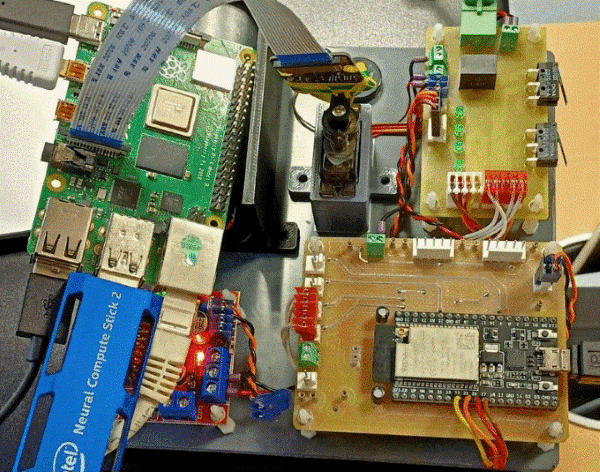
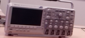
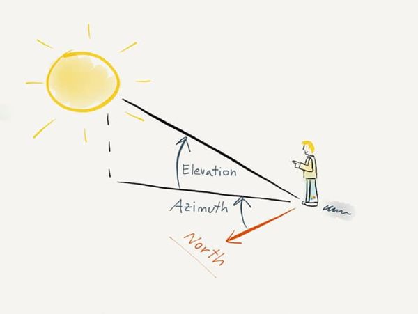
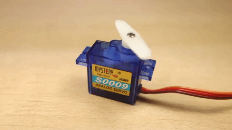

# General information
- **UV** : ASAI
- **Name** : Fabien Plouvier 
- **Date** : 10/10/2022 -> 09/11/2022

📌This branch of our Git repository corresponds to my work for AI recognition.
  
## What is the context?
🛠️The specifications were :  
1. The Pi Camera captures video in real time  
2. Each frame is analysed by a Python program on the Raspberry
3. The program is able to track an object in the camera
4. A connected servo adjusts its viewing angle to focus on the traced object
        
## What are the tools available?
**The KIT : Raspberry pi 4 card  + Servo + ESP32**  
  

## How does it work?
The principle is to perform an object tracking program.  
For this, we used the match template tool of the OpenCV library.  

### What is the match template?  
It is the python function ``cv2.matchTemplate()`` which : 
- takes as input a template (image of the reference object) and an image to be compared (that of the camera for example).
- will browse the image to be analysed and compared to the template.
- returns the scores for each comparison.

### What difficulties have been experienced?
The major difficulty was performance concerns.  
The comparison operation slows down the overall processing considerably, for an 800x600 image, with an 80x50 template, it takes about 15-20 fps to process.

### What are the solutions provided?
To increase performance and optimise our tracking, I used a **dynamic detection zone**.  
This is an area that will define the theoretical location of the object to be tracked.  
This zone adapts itself according to the movements of the object, its speed, its acceleration.  
Therefore, **instead of scanning the entire image, we first search in the detection zone**. If there is still no recognition, we search the whole image

### What happens in practice?
Here is a demonstration of smart tracking.  
1) An object (here an oscilloscope) is defined as template, here is its image (real size) after cropping the first frame :  
  

2) The program then deduces the initial coordinates of the detection zone.  
During a movement on the x-axis (left or right), the **azimuth** is calculated.  
The **azimuth** is the angle formed by the difference in distance between the centre of the image taken by the camera and the centre of the detection area:  
  

3) The servo changes its angle according to the azimuth, for example :  
 

4) This results in efficient tracking of the moving object :  
<video width="514" height="370" controls>
  <source src="https://github.com/Fatichti/ASAI/tree/AI-Recognition/data/gitReadme/demoSmartTracking.mp4" type="video/mp4">
</video>  

⚠️ *The PiCamera is a NoIR camera (NoIR = No Infrared filter) which explains the particular colour shade*

## What is in the branch?
To complete these specifications, I created the folder 📂 **"AIRecognition"** which contains the Python recognition script.

👀For a better understanding, here is **the tree structure** of this branch:  
```bash
├── readme.md
├── data                                # The data necessary for the operation of the scripts and for the structure of the git
│   ├── gitReadme                       # For the structure of the git
│   ├── yolo                            # To get started with Yolo
│   └── recognition                     # For the main recognition
└── AIRecognition
    ├── smartTracking.py                # Main program: camera + recognition + matching + servo
    └── yolo.py                         # Program to get started with yolo
```

## How to install and run the scripts?
⚠️To be able to use our work correctly, please follow the steps for **installing** and **running** the files/scripts.

### Installation

1. Clone the folder in your directory: 
```git
git clone https://github.com/Fatichti/ASAI.git
```

2. Change the current git branch
```git
git checkout AI-Recognition
```

3. Install the yolo files (large files)  
Links :
    - [yolov3.weights](https://pjreddie.com/media/files/yolov3.weights)
    - [yolov2.cfg](https://opencv-tutorial.readthedocs.io/en/latest/_downloads/10e685aad953495a95c17bfecd1649e5/yolov3.cfg)
    - [coco.names](https://opencv-tutorial.readthedocs.io/en/latest/_downloads/a9fb13cbea0745f3d11da9017d1b8467/coco.names)  

    And put them in ``data/yolo`` folder.  

### Running
After adjusting the parameters of the scripts, launch any Python script :
```Bash
python AIRecogntion/smartTracking.py    # To start the main recognition program
```  
Or  
```Bash
python AIRecogntion/yolo.py              # To test yolo on an image
```