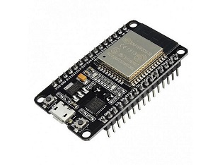

# General information
- **UV** : ASAI
- **Name** : Fabien Plouvier
- **Date** : 10/10/2022 -> 09/11/2022

📌This directory corresponds to the work done for my Automotive System & Embedded AI course.
  
# What is the context?

## The specifications

🛠️The main objectives of the course were :  

- Use a Microchip dsPICDEM 2 card with the dsPIC30F microcontroller
- Getting started with the ESP32 microcontroller
- Develop recognition program on Raspberry Pi 4 - Yolo Python, OpenCV
- Object / face tracing with EPS32 Servo and recognition on Raspberry

## The tools available

Our project is based on the programming of different cards. 

**The dsPICDEM 2 card :**   

  
*[Specification here](https://www.microchip.com/en-us/development-tool/DM300018)*  

**The Raspberry pi 4 card :**   

  
*[Specification here](https://www.raspberrypi.com/products/raspberry-pi-4-model-b/)*  

**The ESP32 microcontroller:**   

  
*[Specification here](https://www.espressif.com/en/products/socs/esp32)*


For more details on how to use these tools and to view additional information such as installation information, **navigate to the different branches** (see below)

# The organisation

We divided the period into 4 weeks to handle each tool

**Week 1 -> 2 :**  
The goal is to get started with the Microship dsPICDEM 2 board.

**Week 2 -> 3 :**  
The goal is to perform MicroPython programming on the ESP32 and Raspberry Pi

**Week 3 -> 4 :**  
The goal is to develop a recognition program using the Raspberry Pi and the Pi Camera

The work is organised in 3 branches as follows:  
- MicroShip
- AI Recognition + ESP32  

To access them, do : 
```git
git checkout branchname # for example : Microchip or AI-Recognition  
```