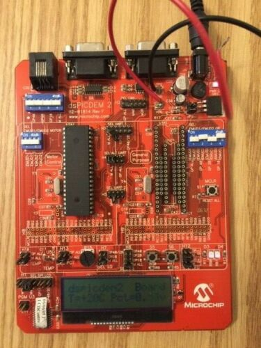

# General information
- **UV** : ASAI
- **Name** : Fabien Plouvier 
- **Date** : 10/10/2022 -> 09/11/2022

📌This branch of our Git repository corresponds to my work for Microchip.
  
## What is the context?
🛠️The specifications were :  
1. Getting started with control input/output pins (Led, Counter, Chaser)  
2. Know how to use interruptions  
3. Getting started with serial input/output control (UART, ADC)  
        
## What are the tools available?
**The dsPICDEM 2 card :**  
  

## How does it work?
The project was divided into several parts where a set of programs coded in C language had to be developed.

## What is in the branch?
To complete these specifications, I created the folder 📂 **"scripts"** which contains the Microchip scripts.

👀For a better understanding, here is **the tree structure** of this branch:  
```bash
├── readme.md
├── data                                # The data necessary for the operation of the scripts and for the structure of the git
│   └── gitReadme                       # For the structure of the git
└── scripts
    ├── LedLighting.c                   # Display of LED D3 or D4 depending on the button pressed S5 or S6
    ├── Counter.c                       # Counter 1 to 15 (4 bits) - S5: increment, S6: decrement
    ├── ChaserLeds.c                    # Chaser 8 LEDS through the bargraph (+ interruption)
    ├── UART.c                          # UARTMain configuration file
    └── UARTMain.c                      # Getting started with UART, character send, echo and LED
```

## How to install and run the scripts?
⚠️To be able to use our work correctly, please follow the steps for **installing** and **running** the files/scripts.

### Installation
*This assumes that you have installed the [MPLAB IDE](https://www.microchip.com/mplab) and have set up the environment for dsPIC30F*
1. Clone the folder in your directory: 
```git
git clone https://github.com/Fatichti/ASAI.git
```

2. Change the current git branch
```git
git checkout Microchip
```

### Running
After adjusting the parameters of the scripts, launch any C script :

``Select a file and click on run in the IDE``

